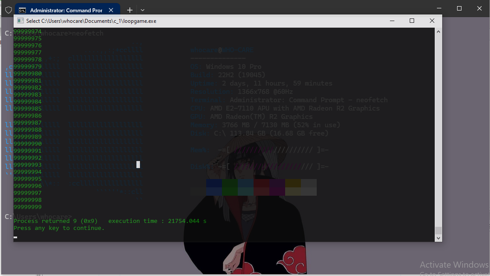

Note :: i use gcc for compile , code::blocks for build and run , visual studio for writing

Note :: in the testloop.cpp and loopgame.c will run until one hundred million counts (100000000) so if you are really learner then change that to low

  

Tip :: you can find explanation in each file after open

Remember :: don't be like just copy and paste if want to lean then see it think it and make another

News :: more ground will be soon

                                         Happy Learning
